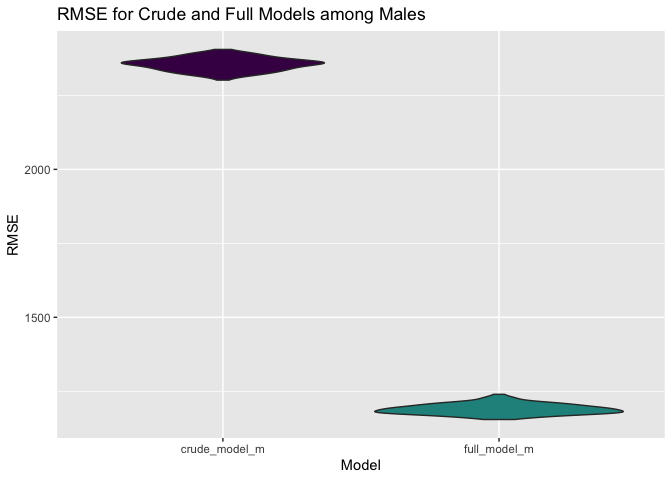
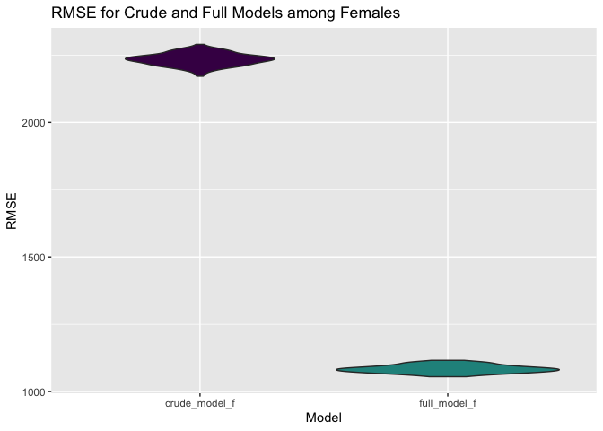

regression
================

``` r
library(tidyverse)
```

    ## ── Attaching packages ─────────────────────────────────────── tidyverse 1.3.1 ──

    ## ✓ ggplot2 3.3.5     ✓ purrr   0.3.4
    ## ✓ tibble  3.1.4     ✓ dplyr   1.0.7
    ## ✓ tidyr   1.1.3     ✓ stringr 1.4.0
    ## ✓ readr   2.0.1     ✓ forcats 0.5.1

    ## ── Conflicts ────────────────────────────────────────── tidyverse_conflicts() ──
    ## x dplyr::filter() masks stats::filter()
    ## x dplyr::lag()    masks stats::lag()

``` r
library(viridis)
```

    ## Loading required package: viridisLite

``` r
library(ggridges)
library(patchwork)
library(lubridate)
```

    ## 
    ## Attaching package: 'lubridate'

    ## The following objects are masked from 'package:base':
    ## 
    ##     date, intersect, setdiff, union

``` r
library(modelr)
```

``` r
years_1 <- c(1900:2012, 2014)
years_2 <- c(2015:2019)

importing_data = function(x){
 
  if(str_detect(x, str_c(years_1, collapse = "|"))) {
  read_csv(x, na = c("NULL", "", "0"), col_types = "cicccciiiicc") 
  } 
  
  else if(str_detect(x, str_c(years_2, collapse = "|"))){
    read_csv(x, na = c("NULL", "", "0"), col_types = "cccicccccccccccccccccciiiiccc")
  }
}

boston_df <- 
  tibble(list.files("data", full.names = TRUE)) %>% 
  setNames("file_name") %>% 
  mutate(data = map(file_name, importing_data)) %>% 
  unnest(data) %>% 
  mutate(year = readr::parse_number(file_name),
         city = coalesce(city, residence),
         display_name = str_replace_all(display_name, "[^a-zA-Z0-9]", " ")) %>% 
  mutate(country_residence = replace(country_residence, country_residence == "AHO", "Netherland Antilles")) %>%
  mutate(country_residence = replace(country_residence, country_residence == "ALB", "Albania")) %>%
  mutate(country_residence = replace(country_residence, country_residence == "ALG", "Algeria")) %>%
  mutate(country_residence = replace(country_residence, country_residence == "AND", "Andorra")) %>%
  mutate(country_residence = replace(country_residence, country_residence == "ARG", "Argentina")) %>%
  mutate(country_residence = replace(country_residence, country_residence == "Argenti", "Argentina")) %>%
  mutate(country_residence = replace(country_residence, country_residence == "AUS", "Australia")) %>%
  mutate(country_residence = replace(country_residence, country_residence == "Austral", "Australia")) %>%
  mutate(country_residence = replace(country_residence, country_residence == "AUT", "Austria")) %>%
  mutate(country_residence = replace(country_residence, country_residence == "BAH", "Bahamas")) %>%
  mutate(country_residence = replace(country_residence, country_residence == "BAR", "Barbados")) %>%
  mutate(country_residence = replace(country_residence, country_residence == "Barbado", "Barbados")) %>%
  mutate(country_residence = replace(country_residence, country_residence == "BDI", "Burundi")) %>%
  mutate(country_residence = replace(country_residence, country_residence == "BLR", "Belarus")) %>%
  mutate(country_residence = replace(country_residence, country_residence == "BEL", "Belgium")) %>%
  mutate(country_residence = replace(country_residence, country_residence == "BER", "Bermuda")) %>%
  mutate(country_residence = replace(country_residence, country_residence == "BRA", "Brazil")) %>%
  mutate(country_residence = replace(country_residence, country_residence == "BRN", "Brunei")) %>%
  mutate(country_residence = replace(country_residence, country_residence == "BUL", "Bulgaria")) %>%
  mutate(country_residence = replace(country_residence, country_residence == "CAN", "Canada")) %>%
  mutate(country_residence = replace(country_residence, country_residence == "CAY", "Cayman")) %>%
  mutate(country_residence = replace(country_residence, country_residence == "CHI", "Chile")) %>%
  mutate(country_residence = replace(country_residence, country_residence == "CHN", "China")) %>%
  mutate(country_residence = replace(country_residence, country_residence == "COL", "Colombia")) %>%
  mutate(country_residence = replace(country_residence, country_residence == "Colombi", "Colombia")) %>%
  mutate(country_residence = replace(country_residence, country_residence == "CRC", "Costa Rica")) %>%
  mutate(country_residence = replace(country_residence, country_residence == "Costa R", "Costa Rica")) %>%
  mutate(country_residence = replace(country_residence, country_residence == "CRO", "Croatia")) %>%
  mutate(country_residence = replace(country_residence, country_residence == "CYP", "Cyprus")) %>%
  mutate(country_residence = replace(country_residence, country_residence == "CZE", "Czech Republic")) %>%
  mutate(country_residence = replace(country_residence, country_residence == "Czech R", "Czech Republic")) %>%
  mutate(country_residence = replace(country_residence, country_residence == "DEN", "Denmark")) %>%
  mutate(country_residence = replace(country_residence, country_residence == "DOM", "Dominican Republic")) %>%
  mutate(country_residence = replace(country_residence, country_residence == "Dominic", "Dominican Republic")) %>%
  mutate(country_residence = replace(country_residence, country_residence == "ECU", "Ecuador")) %>%
  mutate(country_residence = replace(country_residence, country_residence == "EGY", "Egypt")) %>%
  mutate(country_residence = replace(country_residence, country_residence == "El Salv", "El Salvador")) %>%
  mutate(country_residence = replace(country_residence, country_residence == "ESA", "El Salvador")) %>%
  mutate(country_residence = replace(country_residence, country_residence == "ESP", "Spain")) %>%
  mutate(country_residence = replace(country_residence, country_residence == "EST", "Estonia")) %>%
  mutate(country_residence = replace(country_residence, country_residence == "ETH", "Ethiopia")) %>%
  mutate(country_residence = replace(country_residence, country_residence == "Ethiopi", "Ethiopia")) %>%
  mutate(country_residence = replace(country_residence, country_residence == "Faroe I", "Faroe Islands")) %>%
  mutate(country_residence = replace(country_residence, country_residence == "FIN", "Finland")) %>%
  mutate(country_residence = replace(country_residence, country_residence == "FLK", "Falkland Islands")) %>%
  mutate(country_residence = replace(country_residence, country_residence == "FRA", "France")) %>%
  mutate(country_residence = replace(country_residence, country_residence == "GBR", "England")) %>%
  mutate(country_residence = replace(country_residence, country_residence == "GER", "Germany")) %>%
  mutate(country_residence = replace(country_residence, country_residence == "GRE", "Greece")) %>%
  mutate(country_residence = replace(country_residence, country_residence == "GRN", "Greenland")) %>%
  mutate(country_residence = replace(country_residence, country_residence == "GUA", "Guatemala")) %>%
  mutate(country_residence = replace(country_residence, country_residence == "Guatema", "Guatemala")) %>%
  mutate(country_residence = replace(country_residence, country_residence == "HKG", "Hong Kong")) %>%
  mutate(country_residence = replace(country_residence, country_residence == "Hong Ko", "Hong Kong")) %>%
  mutate(country_residence = replace(country_residence, country_residence == "HON", "Honduras")) %>%
  mutate(country_residence = replace(country_residence, country_residence == "Hondura", "Honduras")) %>%
  mutate(country_residence = replace(country_residence, country_residence == "HUN", "Hungary")) %>%
  mutate(country_residence = replace(country_residence, country_residence == "INA", "Indonesia")) %>%
  mutate(country_residence = replace(country_residence, country_residence == "Indones", "Indonesia")) %>%
  mutate(country_residence = replace(country_residence, country_residence == "IND", "India")) %>%
  mutate(country_residence = replace(country_residence, country_residence == "IRL", "Ireland")) %>%
  mutate(country_residence = replace(country_residence, country_residence == "ISL", "Iceland")) %>%
  mutate(country_residence = replace(country_residence, country_residence == "ISR", "Israel")) %>%
  mutate(country_residence = replace(country_residence, country_residence == "ITA", "Italy")) %>%
  mutate(country_residence = replace(country_residence, country_residence == "JAM", "Jamaica")) %>%
  mutate(country_residence = replace(country_residence, country_residence == "JPN", "Japan")) %>%
  mutate(country_residence = replace(country_residence, country_residence == "JOR", "Jordan")) %>%
  mutate(country_residence = replace(country_residence, country_residence == "KEN", "Kenya")) %>%
  mutate(country_residence = replace(country_residence, country_residence == "KOR", "Korea")) %>%
  mutate(country_residence = replace(country_residence, country_residence == "Korea,", "Korea")) %>%
  mutate(country_residence = replace(country_residence, country_residence == "KSA", "Saudi Arabia")) %>%
  mutate(country_residence = replace(country_residence, country_residence == "KUW", "Kuwait")) %>%
  mutate(country_residence = replace(country_residence, country_residence == "LAT", "Latvia")) %>%
  mutate(country_residence = replace(country_residence, country_residence == "LIE", "Liechtenstein")) %>%
  mutate(country_residence = replace(country_residence, country_residence == "Liechte", "Liechtenstein")) %>%
  mutate(country_residence = replace(country_residence, country_residence == "Lithuan", "Lithuania")) %>%
  mutate(country_residence = replace(country_residence, country_residence == "LTU", "Lithuania")) %>%
  mutate(country_residence = replace(country_residence, country_residence == "LUX", "Luxembourg")) %>%
  mutate(country_residence = replace(country_residence, country_residence == "Luxembo", "Luxembourg")) %>%
  mutate(country_residence = replace(country_residence, country_residence == "Macao S", "Macao")) %>%
  mutate(country_residence = replace(country_residence, country_residence == "Macedon", "Macedonia")) %>%
  mutate(country_residence = replace(country_residence, country_residence == "Malaysi", "Malaysia")) %>%
  mutate(country_residence = replace(country_residence, country_residence == "MAR", "Martinique")) %>%
  mutate(country_residence = replace(country_residence, country_residence == "Martini", "Martinique")) %>%
  mutate(country_residence = replace(country_residence, country_residence == "MAS", "Malaysia")) %>%
  mutate(country_residence = replace(country_residence, country_residence == "MEX", "Mexico")) %>%
  mutate(country_residence = replace(country_residence, country_residence == "MGL", "Mongolia")) %>%
  mutate(country_residence = replace(country_residence, country_residence == "MLT", "Malta")) %>%
  mutate(country_residence = replace(country_residence, country_residence == "NCA", "Nicaragua")) %>%
  mutate(country_residence = replace(country_residence, country_residence == "NED", "Netherlands")) %>%
  mutate(country_residence = replace(country_residence, country_residence == "Netherl", "Netherlands")) %>%
  mutate(country_residence = replace(country_residence, country_residence == "New Zea", "New Zealand")) %>%
  mutate(country_residence = replace(country_residence, country_residence == "NGR", "Nigeria")) %>%
  mutate(country_residence = replace(country_residence, country_residence == "NOR", "Norway")) %>%
  mutate(country_residence = replace(country_residence, country_residence == "NZL", "New Zealand")) %>%
  mutate(country_residence = replace(country_residence, country_residence == "OMA", "Oman")) %>%
  mutate(country_residence = replace(country_residence, country_residence == "PAK", "Pakistan")) %>%
  mutate(country_residence = replace(country_residence, country_residence == "Palesti", "Palestine")) %>%
  mutate(country_residence = replace(country_residence, country_residence == "PAN", "Panama")) %>%
  mutate(country_residence = replace(country_residence, country_residence == "PAR", "Paraguay")) %>%
  mutate(country_residence = replace(country_residence, country_residence == "Paragua", "Paraguay")) %>%
  mutate(country_residence = replace(country_residence, country_residence == "PER", "Peru")) %>%
  mutate(country_residence = replace(country_residence, country_residence == "PHI", "Philippines")) %>%
  mutate(country_residence = replace(country_residence, country_residence == "Philipp", "Philippines")) %>%
  mutate(country_residence = replace(country_residence, country_residence == "POL", "Poland")) %>%
  mutate(country_residence = replace(country_residence, country_residence == "POR", "Portugal")) %>%
  mutate(country_residence = replace(country_residence, country_residence == "Portuga", "Portugal")) %>%
  mutate(country_residence = replace(country_residence, country_residence == "Puerto", "Puerto Rico")) %>%
  mutate(country_residence = replace(country_residence, country_residence == "QAT", "Qatar")) %>%
  mutate(country_residence = replace(country_residence, country_residence == "ROU", "Romania")) %>%
  mutate(country_residence = replace(country_residence, country_residence == "Saudi A", "Saudi Arabia")) %>%
  mutate(country_residence = replace(country_residence, country_residence == "SIN", "Singapore")) %>%
  mutate(country_residence = replace(country_residence, country_residence == "Singapo", "Singapore")) %>%
  mutate(country_residence = replace(country_residence, country_residence == "SLO", "Slovenia")) %>%
  mutate(country_residence = replace(country_residence, country_residence == "Slovaki", "Slovakia")) %>%
  mutate(country_residence = replace(country_residence, country_residence == "Sloveni", "Slovenia")) %>%
  mutate(country_residence = replace(country_residence, country_residence == "SMR", "San Marino")) %>%
  mutate(country_residence = replace(country_residence, country_residence == "South A", "South Africa")) %>%
  mutate(country_residence = replace(country_residence, country_residence == "SRB", "Serbia")) %>%
  mutate(country_residence = replace(country_residence, country_residence == "Sri Lan", "Sri Lanka")) %>%
  mutate(country_residence = replace(country_residence, country_residence == "SUI", "Switzerland")) %>%
  mutate(country_residence = replace(country_residence, country_residence == "SVK", "Slovakia")) %>%
  mutate(country_residence = replace(country_residence, country_residence == "SWE", "Sweden")) %>%
  mutate(country_residence = replace(country_residence, country_residence == "Switzer", "Switzerland")) %>%
  mutate(country_residence = replace(country_residence, country_residence == "TCA", "Turks and Caicos")) %>%
  mutate(country_residence = replace(country_residence, country_residence == "THA", "Thailand")) %>%
  mutate(country_residence = replace(country_residence, country_residence == "Thailan", "Thailand")) %>%
  mutate(country_residence = replace(country_residence, country_residence == "TPE", "Taipei")) %>%
  mutate(country_residence = replace(country_residence, country_residence == "TRI", "Trinidad")) %>%
  mutate(country_residence = replace(country_residence, country_residence == "Trinida", "Trinidad")) %>%
  mutate(country_residence = replace(country_residence, country_residence == "TUR", "Turkey")) %>%
  mutate(country_residence = replace(country_residence, country_residence == "TWN", "Taiwan")) %>%
  mutate(country_residence = replace(country_residence, country_residence == "UAE", "United Arab Emirates")) %>%
  mutate(country_residence = replace(country_residence, country_residence == "UGA", "Uganda")) %>%
  mutate(country_residence = replace(country_residence, country_residence == "UKR", "Ukraine")) %>%
  mutate(country_residence = replace(country_residence, country_residence == "United", "United States")) %>%
  mutate(country_residence = replace(country_residence, country_residence == "URU", "Uruguay")) %>%
  mutate(country_residence = replace(country_residence, country_residence == "USA", "United States")) %>%
  mutate(country_residence = replace(country_residence, country_residence == "VEN", "Venezuela")) %>%
  mutate(country_residence = replace(country_residence, country_residence == "Venezue", "Venezuela")) %>%
  mutate(country_residence = replace(country_residence, country_residence == "VGB", "Virgin Islands")) %>%
  mutate(country_residence = replace(country_residence, country_residence == "VIE", "Vietnam")) %>%
  mutate(country_residence = replace(country_residence, country_residence == "ZIM", "Zimbabwe")) %>%
  mutate(country_residence = replace(country_residence, country_residence == "RSA", "South Africa")) %>%
  mutate(country_residence = replace(country_residence, country_residence == "RUS", "Russia")) %>%
  mutate(country_residence = replace(country_residence, country_residence == "Russian", "Russia")) %>%
  filter(!is.na(display_name)) %>% 
  select(-file_name, -residence, -first_name, -last_name)

boston_df$continent[boston_df$country_residence %in% c(
  "Australia", 
  "New Zealand"
  )] <- "Australia"
```

    ## Warning: Unknown or uninitialised column: `continent`.

``` r
boston_df$continent[boston_df$country_residence %in% c(
  "Algeria",
  "Burundi",
  "Egypt",
  "Ethiopia",
  "Kenya",  
  "Morocco", 
  "Nigeria,",  
  "South Africa", 
  "Uganda",
  "Zimbabwe"
  )] <- "Africa"
boston_df$continent[boston_df$country_residence %in% c(
 "China", 
  "Hong Kong", 
  "India",            
  "Indonesia",
  "Israel",  
  "Japan",               
  "Jordan", 
  "Korea",   
  "Malaysia",
  "Mongolia",              
  "Nepal",  
  "Oman", 
  "Pakistan",            
  "Palestine", 
  "Philippines", 
  "Qatar",   
  "Russia", 
  "Saudi Arabia",
  "Singapore",  
  "Sri Lanka",  
  "Taipei",               
  "Taiwan",            
  "Thailand",  
  "Vietnam", 
  "Brunei", 
  "Kuwait",                         
  "Macao",
  "United Arab Emirates"                                  
  )] <- "Asia"
boston_df$continent[boston_df$country_residence %in% c(
  "Canada",  
  "Mexico", 
  "Puerto Rico",
  "United States",
  "Bahamas",                        
  "Barbados",
  "Belize",              
  "Bermuda", 
  "Cayman",                
  "Dominican Republic",  
  "Jamaica", 
  "Martinique",
  "Virgin Islands"                                                           
  )] <- "North America"
boston_df$continent[boston_df$country_residence %in% c(
  "Argentina", 
  "Bolivia",                
  "Brazil", 
  "Chile", 
  "Colombia",           
  "Costa Rica",  
  "Ecuador",  
  "El Salvador", 
  "Guatemala",             
  "Honduras", 
  "Nicaragua",  
  "Panama",             
  "Paraguay", 
  "Peru",  
  "Uruguay",            
  "Venezuela",
  "Aruba",
  "Falkland Island",
  "Trinidad"
  )] <- "South America"
boston_df$continent[boston_df$country_residence %in% c(
  "Albania", 
  "Andorra",            
  "Armenia",
  "Austria",
  "Bahrain",
  "Belarus",
  "Belgium",  
  "Bulgaria", 
  "Croatia", 
  "Cyprus",       
  "Czech Republic",              
  "Denmark",   
  "England", 
  "Finland",               
  "France",              
  "Germany",               
  "Greece", 
  "Greenland", 
  "Hungary",              
  "Iceland",
  "Ireland",                             
  "Italy", 
  "Latvia",        
  "Liechtenstein",            
  "Lithuania", 
  "Luxembourg", 
  "Netherland Antilles",          
  "Netherlands", 
  "Norway",    
  "Poland",             
  "Portugal", 
  "Romania",
  "Serbia",              
  "Slovakia",             
  "Slovenia",
  "Spain",            
  "Sweden",          
  "Switzerland", 
  "Turkey",     
  "Turks and Caicos",
  "Ukraine",
  "Bosnia", 
  "Estonia",                
  "Faroe Islands", 
  "Macedonia",             
  "Malta",     
  "Moldova",               
  "Monaco", 
  "San Marino"  
  )] <- "Europe"
```

## Creating dataset for regression

``` r
regression_df = boston_df %>%
  select(seconds, age, continent, gender, year, "5k") %>%
  rename(fivek = "5k") %>%
  mutate(fivetime = hms(fivek)) %>%
  drop_na() %>%
  mutate(fivek_seconds = hour(fivetime)*3600 + minute(fivetime)*60 + second(fivetime))
```

    ## Warning in .parse_hms(..., order = "HMS", quiet = quiet): Some strings failed to
    ## parse, or all strings are NAs

## Creating male and female datasets

``` r
regression_m_df = regression_df %>%
  filter(gender == "M")

regression_f_df = regression_df %>%
  filter(gender == "F")
```

## Crude - age, continent by gender

``` r
crude_model_m = lm(seconds ~ age + continent, data = regression_m_df)

crude_model_m %>% 
  broom::tidy() %>% 
  knitr::kable(digits = 3)
```

| term                   | estimate | std.error | statistic | p.value |
|:-----------------------|---------:|----------:|----------:|--------:|
| (Intercept)            | 8778.932 |   274.501 |    31.981 |   0.000 |
| age                    |   76.020 |     0.987 |    77.010 |   0.000 |
| continentAsia          | 1794.641 |   279.120 |     6.430 |   0.000 |
| continentAustralia     | 1009.802 |   299.782 |     3.368 |   0.001 |
| continentEurope        | 1165.792 |   274.729 |     4.243 |   0.000 |
| continentNorth America | 1264.576 |   271.947 |     4.650 |   0.000 |
| continentSouth America |  384.063 |   283.467 |     1.355 |   0.175 |

``` r
crude_model_f = lm(seconds ~ age + continent, data = regression_f_df)

crude_model_f %>% 
  broom::tidy() %>% 
  knitr::kable(digits = 3)
```

| term                   |  estimate | std.error | statistic | p.value |
|:-----------------------|----------:|----------:|----------:|--------:|
| (Intercept)            | 10817.844 |   317.772 |    34.043 |   0.000 |
| age                    |    43.542 |     1.115 |    39.057 |   0.000 |
| continentAsia          |  2568.788 |   332.533 |     7.725 |   0.000 |
| continentAustralia     |  1560.455 |   351.282 |     4.442 |   0.000 |
| continentEurope        |  2174.944 |   323.024 |     6.733 |   0.000 |
| continentNorth America |  2124.174 |   315.727 |     6.728 |   0.000 |
| continentSouth America |   989.917 |   338.007 |     2.929 |   0.003 |

## Full model - age, continent, 5k by gender

``` r
full_model_m = lm(seconds ~ age + continent + fivek_seconds, data = regression_m_df)

full_model_m %>% 
  broom::tidy() %>% 
  knitr::kable(digits = 3)
```

| term                   | estimate | std.error | statistic | p.value |
|:-----------------------|---------:|----------:|----------:|--------:|
| (Intercept)            | -488.195 |   141.232 |    -3.457 |   0.001 |
| age                    |    9.248 |     0.533 |    17.339 |   0.000 |
| continentAsia          |  648.669 |   141.174 |     4.595 |   0.000 |
| continentAustralia     |  254.215 |   151.600 |     1.677 |   0.094 |
| continentEurope        |  208.146 |   138.943 |     1.498 |   0.134 |
| continentNorth America |  164.040 |   137.545 |     1.193 |   0.233 |
| continentSouth America |  142.167 |   143.337 |     0.992 |   0.321 |
| fivek\_seconds         |    9.127 |     0.026 |   355.204 |   0.000 |

``` r
full_model_f = lm(seconds ~ age + continent + fivek_seconds, data = regression_f_df)

full_model_f %>% 
  broom::tidy() %>% 
  knitr::kable(digits = 3)
```

| term                   |  estimate | std.error | statistic | p.value |
|:-----------------------|----------:|----------:|----------:|--------:|
| (Intercept)            | -1101.838 |   157.997 |    -6.974 |   0.000 |
| age                    |     8.778 |     0.550 |    15.957 |   0.000 |
| continentAsia          |   626.278 |   161.372 |     3.881 |   0.000 |
| continentAustralia     |   221.038 |   170.410 |     1.297 |   0.195 |
| continentEurope        |   331.924 |   156.753 |     2.117 |   0.034 |
| continentNorth America |   220.911 |   153.222 |     1.442 |   0.149 |
| continentSouth America |    89.302 |   163.948 |     0.545 |   0.586 |
| fivek\_seconds         |     9.437 |     0.028 |   342.380 |   0.000 |

## Comparing models for males

``` r
crossv_m = 
  crossv_mc(regression_m_df, 100) %>% 
  mutate(train = map(train, as_tibble), test = map(test, as_tibble))

crossv_m = crossv_m %>% 
  mutate(
    crude_model_m = map(train, ~lm(seconds ~ age +continent, data = .x)),
    full_model_m = map(train, ~lm(seconds ~ age + continent + fivek_seconds, data = .x))) %>% 
  mutate(
    rmse_crude_model_m = map2_dbl(crude_model_m, test, ~rmse(model = .x, data = .y)),
    rmse_full_model_m= map2_dbl(full_model_m, test, ~rmse(model = .x, data = .y))) %>%
  select(starts_with("rmse")) %>%  
  pivot_longer(
    everything(),
    names_to = "model", 
    values_to = "rmse",
    names_prefix = "rmse_") %>% 
  mutate(model = fct_inorder(model)) 

ggplot(crossv_m, aes(x = model, y = rmse)) +
geom_violin(trim = TRUE, fill = viridis(n = 1024)) +
labs(x = "Model", y = "RMSE") +
ggtitle("RMSE for Crude and Full Models among Males") 
```

<!-- -->

## Comparing models for females

``` r
crossv_f = 
  crossv_mc(regression_f_df, 100) %>% 
  mutate(train = map(train, as_tibble), test = map(test, as_tibble))

crossv_f = crossv_f %>% 
  mutate(
    crude_model_f = map(train, ~lm(seconds ~ age +continent, data = .x)),
    full_model_f = map(train, ~lm(seconds ~ age + continent + fivek_seconds, data = .x))) %>% 
  mutate(
    rmse_crude_model_f = map2_dbl(crude_model_f, test, ~rmse(model = .x, data = .y)),
    rmse_full_model_f = map2_dbl(full_model_f, test, ~rmse(model = .x, data = .y))) %>%
  select(starts_with("rmse")) %>%  
  pivot_longer(
    everything(),
    names_to = "model", 
    values_to = "rmse",
    names_prefix = "rmse_") %>% 
  mutate(model = fct_inorder(model)) 

ggplot(crossv_f, aes(x = model, y = rmse)) +
geom_violin(trim = TRUE, fill = viridis(n = 1024)) +
labs(x = "Model", y = "RMSE") +
ggtitle("RMSE for Crude and Full Models among Females") 
```

<!-- -->
