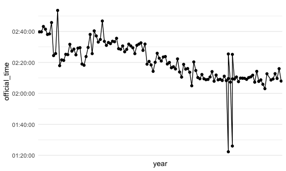

Winner over time
================

``` r
library(tidyverse)
```

    ## Warning in as.POSIXlt.POSIXct(Sys.time()): unknown timezone '2:39:44'

    ## ── Attaching packages ─────────────────────────────────────── tidyverse 1.3.1 ──

    ## ✓ ggplot2 3.3.5     ✓ purrr   0.3.4
    ## ✓ tibble  3.1.4     ✓ dplyr   1.0.7
    ## ✓ tidyr   1.1.3     ✓ stringr 1.4.0
    ## ✓ readr   2.0.1     ✓ forcats 0.5.1

    ## ── Conflicts ────────────────────────────────────────── tidyverse_conflicts() ──
    ## x dplyr::filter() masks stats::filter()
    ## x dplyr::lag()    masks stats::lag()

``` r
library(viridis)
```

    ## Loading required package: viridisLite

``` r
library(ggridges)
library(patchwork)
library(plotly)
```

    ## 
    ## Attaching package: 'plotly'

    ## The following object is masked from 'package:ggplot2':
    ## 
    ##     last_plot

    ## The following object is masked from 'package:stats':
    ## 
    ##     filter

    ## The following object is masked from 'package:graphics':
    ## 
    ##     layout

``` r
library(hms)

knitr::opts_chunk$set(
  echo = TRUE,
  warning = FALSE, 
  fig.width = 6, 
  fig.asp = .6,
  out.width = "90%"
)
theme_set(theme_minimal() + theme(legend.position = "bottom"))

options(
  ggplot2.continuous.colour = "viridis",
  ggplot2.continuous.fill = "virids"
)

scale_colour_discrete = scale_color_viridis_d
scale_fill_discrete = scale_fill_viridis_d
```

``` r
years_1 <- c(1900:2012, 2014)
years_2 <- c(2015:2019)

importing_data = function(x){
 
  if(str_detect(x, str_c(years_1, collapse = "|"))) {
  read_csv(x, na = c("NULL", "", "0"), col_types = "cicccciiiicc") 
  } 
  
  else if(str_detect(x, str_c(years_2, collapse = "|"))){
    read_csv(x, na = c("NULL", "", "0"), col_types = "cccicccccccccccccccccciiiiccc")
  }
}

boston_df <- 
  tibble(list.files("data", full.names = TRUE)) %>% 
  setNames("file_name") %>% 
  mutate(data = map(file_name, importing_data)) %>% 
  unnest(data) %>% 
  mutate(year = readr::parse_number(file_name),
         city = coalesce(city, residence),
         display_name = str_replace_all(display_name, "[^a-zA-Z0-9]", " ")) %>% 
  filter(!is.na(display_name)) %>% 
  select(-file_name, -residence)
```

### do you need hms or is it part of tidyverse?

``` r
winners_df = 
  boston_df %>% 
    mutate(
      official_time = as.hms(official_time, tz = ""),
      pace = as.hms(pace, tz = "", format = "%H:%M:%S"),
      place_overall = as.numeric(place_overall)
      )
```

Make winners over time plot

-   look at points 1990-2000 where time is \~1:20:00

``` r
winners_df %>% 
  filter(overall == 1) %>% 
  arrange(year) %>% 
ggplot(aes(x = year, y = official_time, group = 1)) +
  geom_point() +
  geom_path() + 
 scale_x_discrete(breaks = c(1910, 1920, 1930, 1940, 1950, 1960, 1970, 1980, 1990, 2000, 2010, 2020))
```


